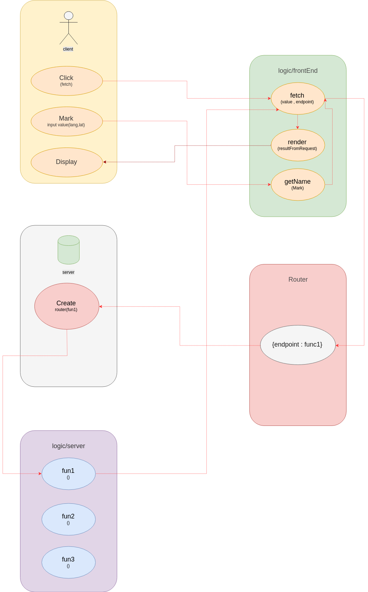

# Weather map :sweat_drops: :cloud: :sunny: :partly_sunny:

by : Abdullah , Balsam , Salam and Ahmed .

[OUR WEBSITE](https://weathermap-saba.herokuapp.com/)

### What :question:

Single web application give the ability for users to know the weather for specific region by searching .

### How :muscle:

* Reading the requirements of project .
* Searching on new topics .
* Discussing the chosen _APIs_ .
* Designing the wireframe .
* Deciding the functions .
* TDD , Supertest , Travis and Heroku .
* Builing server .

> we work depend on the flow that attach .



### How to use  :computer:
* Heroku :
  * Click the link above :point_up:
* Locally :
  * Clone the repo .
  * In terminal Run :
    * ``` npm i ``` .
    * ``` npm start ``` .
  * In browser :
    - ``` localhost:5000 ``` .


> Our Travis preview :

[](https://travis-ci.org/FACG4/weatherMap)
